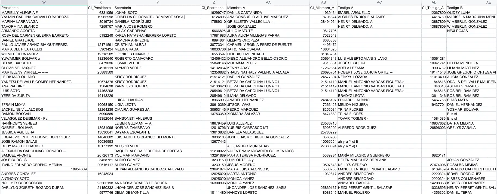

# Procesador de actas de las mesas de resultados electorales en Venezuela 2024

El siguiente proyecto tiene como objetivo procesar las actas de las mesas de resultados electorales en Venezuela 2024 para extraer la información referente a los miembros de las mesas electorales.

El script `descargar_actas.py` se encarga de descargar las actas en el directorio `actas`. Mientras que el script `extraer_informacion_miembros.py` se encarga de extraer la información de los miembros de las mesas  y las inserta como nuevas columnas en el csv `RESULTADOS_2024_CSV_V1.csv`.

<span style="color: red;">**NOTA:**</span> Para el procesamiento de las actas se utiliza el engine OCR [Tesseract](https://github.com/madmaze/pytesseract). Debido a que, en muchos de los casos las imágnes no tienen la mejor calidad, muchos de los resultados no son los esperados. Este script se elaboró como un ejemplo y no debe ser utilizado como referencia para el procesamiento de las actas.



# Requisitos

- Python 3.10 o superior
- [Tesseract](https://github.com/madmaze/pytesseract)

## Instalación 

## Creación del entorno virtual

```shell
python -m venv venv
```

## Activación y desactivación del entorno virtual

**Para activar el entorno virtual**
```shell
source venv/bin/activate
```

**Para desactivar el entorno virtual**
```shell
deactivate
```

## Instalación de las dependencias

```shell
pip install -r requirements.txt
```

## Descargar actas

```shell
python descargar_actas.py
```

## Procesar y extraer la información

```shell
python extraer_informacion_miembros.py
```